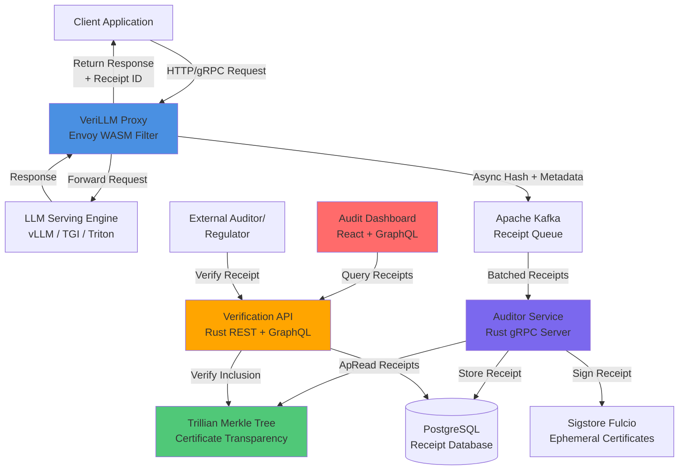

# Open Source Publication - Cryptographic Receipts for Verifiable AI Inference

<table>
<tr>
<td width="200">
  
</td>
<td>
  <h3>Transform Black-Box AI into Legally Defensible, Auditable Artefacts</h3>
  
  **Core Capabilities:**
  - 🔐 Cryptographically Signed Inference Receipts
  - 📋 Tamper-Evident Audit Trails with Merkle Tree Verification
  - ⚡ Sub-5ms Overhead on Production LLM Serving
  - 🏥 Healthcare & Finance-Ready Compliance (HIPAA, GDPR, EU AI Act)
  - 🔍 Complete Model Lineage Tracking (Versions, Adapters, Hyperparameters)
  - 🌐 Cloud-Agnostic Integration (AWS, Azure, GCP)
</td>
</tr>
</table>

<p align="center"> 
  <a href="https://github.com/verillm/verillm/releases"></a>
  <a href="https://opensource.org/licenses/MIT"></a>
  <a href="https://github.com/verillm/verillm/pulls"></a>
  <a href="https://goreportcard.com/report/github.com/verillm/verillm"></a>
</p>

<p align="center">
  <a href="#about">About</a> •
  <a href="#the-problem">The Problem</a> •
  <a href="#key-features">Key Features</a> •
  <a href="#getting-started">Getting Started</a> •
  <a href="#installation">Installation</a> •
  <a href="#architecture">Architecture</a> •
  <a href="#verification">Verification</a> •
  <a href="#contributing">Contributing</a>
</p>

---

## About

**VeriLLM** is an open-source, cryptographic provenance platform that attaches a tamper-evident, digitally signed receipt to every inference response generated by a large language model. By integrating transparently into the serving path with sub-millisecond overhead, VeriLLM transforms opaque AI outputs into legally defensible, independently verifiable artefacts.

Traditional AI systems operate as black boxes—when a model produces a response, no one can definitively prove which model version was used, what configurations were active, or whether the deployment was authorized. VeriLLM solves this critical gap by providing cryptographic proof of:

- **Model Identity**: Exact version hash of the base model and all active adapters
- **Deployment Context**: Environment fingerprint, timestamp, and approval status  
- **Privacy Accountability**: Differential privacy budget consumption tracking
- **Regulatory Evidence**: Self-contained proofs for HIPAA, GDPR, and EU AI Act compliance

Built on battle-tested infrastructure from Certificate Transparency and Sigstore, VeriLLM brings the same level of cryptographic verifiability that secures web PKI to the entirely novel domain of AI inference. The platform serves enterprises running mission-critical AI workloads in healthcare, finance, legal, and public sectors—where trust in AI is not optional but mandatory.

**Why VeriLLM Matters**: When a hospital's AI misdiagnoses a patient, when a bank's model denies a loan unfairly, or when a legal AI gives incorrect advice, organizations face million-dollar lawsuits and cannot reconstruct what happened. VeriLLM ensures that every AI decision comes with a cryptographic receipt that can prove—to regulators, auditors, and affected individuals—exactly what the system did.

---

## The Problem

### The Invisible Crisis of AI Accountability

**73% of healthcare professionals won't trust AI without verifiable audit trails**

Modern AI deployments create silent liability. Every time a large language model generates a response in production, critical questions remain unanswered:

- **Model Uncertainty**: Which exact model version produced this output?
- **Configuration Opacity**: What adapters, prompts, and hyperparameters were active?
- **Authorization Gap**: Was this model approved for this specific use case?
- **Audit Blindness**: Can regulators independently verify the response without internal access?

### Real-World Consequences

| Impact Area | Consequences |
|-------------|--------------|
| **Legal** | US hospital settled for $12M after AI triage tool error; could not prove model version responsible |
| **Regulatory** | EU AI Act fines up to €30M or 6% of global turnover for AI systems lacking full traceability |
| **Operational** | 64% of compliance teams distrust existing logs; spend $2.5M annually on manual governance |
| **Clinical** | 73% of radiologists refuse AI adoption without independent model verification capabilities |

### Why Current Solutions Fail

Existing AI governance vendors (Zenity, Arthur AI, Secure Privacy) provide dashboards and monitoring—but they fundamentally do not solve verification because:

- ❌ They operate on **mutable logs after the fact** that can be altered or deleted
- ❌ They provide **no cryptographic proof** of model lineage at inference time  
- ❌ Their audit reports are themselves **not independently verifiable**
- ❌ They **observe rather than attest**—they watch but cannot prove

**VeriLLM is different.** It is a cryptographic co-processor that generates tamper-evident receipts at inference time, creating an immutable, independently verifiable record that serves as the single source of truth for regulatory defense, litigation, and patient safety.

---

## Key Features

### Cryptographic Receipts
Every inference generates a digitally signed receipt containing the complete decision context: model hash, adapter identifiers, hyperparameters, timestamp, and deployment environment. Receipts use BLAKE3 hashing and Ed25519 signatures anchored in a public transparency log, making them mathematically provable and independently verifiable without granting internal system access.

### Tamper-Evident Audit Trails  
All receipts are appended to an immutable Merkle tree (powered by Google's Trillian) with cryptographic inclusion proofs. Any attempt to alter or delete a historical receipt is instantly detectable. Audit exports contain complete cryptographic chains that regulators can verify using open-source tools.

### Production-Grade Performance
Sub-5ms p99 latency overhead when processing 10,000+ requests per second. Zero-copy hashing, batched Merkle tree updates, and asynchronous receipt generation ensure VeriLLM adds negligible latency to production serving. Works seamlessly with vLLM, HuggingFace TGI, NVIDIA Triton, and TensorFlow Serving.

### Healthcare & Finance Ready
Built from day one for high-stakes regulated environments. GDPR-compliant privacy-preserving receipts, HIPAA audit trail requirements, EU AI Act conformity assessments, and SOC 2 readiness. Includes role-based access control, encrypted persistence, and air-gapped deployment options.

### Complete Model Lineage
Automatic capture of base model version hashes, LoRA/prefix adapter identifiers, prompt template IDs, and hyperparameter configurations. Service dependency mapping shows which models call which retrieval systems or external APIs. Critical path identification for debugging distributed AI systems.

### Cloud-Agnostic & Non-Intrusive
Drop-in deployment as an Envoy WebAssembly filter—no changes to model weights, training pipelines, or inference code. Works across AWS Lambda, Azure Functions, Google Cloud Functions, and on-premises Kubernetes. Integration takes minutes, not weeks.

---

## Getting Started

### Prerequisites
- Kubernetes cluster (or Docker Compose for development)
- Active LLM serving endpoint (vLLM, TGI, Triton, etc.)
- Basic understanding of HTTP proxies and Envoy

### Quick Start

```bash
# Install VeriLLM CLI
curl -sSL https://get.verillm.dev | sh

# Initialize configuration
verillm init --endpoint http://your-llm-server:8000

# Deploy as Envoy sidecar
verillm deploy sidecar --namespace ai-production

# Verify installation
verillm health-check
```

**Access your audit dashboard at:** `http://localhost:8080`

---

## Installation

### Kubernetes Deployment (Recommended)

```bash
# Add VeriLLM Helm repository
helm repo add verillm https://helm.verillm.dev
helm repo update

# Install VeriLLM stack (proxy, auditor, Trillian, dashboard)
helm install verillm verillm/verillm \
  --namespace verillm-system \
  --create-namespace \
  --set proxy.upstreamUrl=http://llm-server:8000 \
  --set sigstore.enabled=true

# Verify deployment
kubectl get pods -n verillm-system
```

### Docker Compose (Development)

```bash
# Clone repository
git clone https://github.com/verillm/verillm
cd verillm

# Configure environment
cp .env.example .env
# Edit .env with your LLM endpoint

# Start all services
docker-compose up -d

# View logs
docker-compose logs -f auditor
```

### Envoy Integration (Existing Infrastructure)

If you already run Envoy, add VeriLLM as a WASM filter:

```yaml
# envoy.yaml
static_resources:
  listeners:
  - name: llm_listener
    address:
      socket_address:
        address: 0.0.0.0
        port_value: 8080
    filter_chains:
    - filters:
      - name: envoy.filters.network.http_connection_manager
        typed_config:
          "@type": type.googleapis.com/envoy.extensions.filters.network.http_connection_manager.v3.HttpConnectionManager
          http_filters:
          - name: verillm_proxy
            typed_config:
              "@type": type.googleapis.com/envoy.extensions.filters.http.wasm.v3.Wasm
              config:
                vm_config:
                  runtime: "envoy.wasm.runtime.v8"
                  code:
                    local:
                      filename: "/etc/envoy/verillm_filter.wasm"
                configuration:
                  "@type": type.googleapis.com/google.protobuf.StringValue
                  value: |
                    {
                      "auditor_endpoint": "http://auditor-service:50051",
                      "model_registry_url": "http://registry:8080",
                      "signing_enabled": true
                    }
          - name: envoy.filters.http.router
          route_config:
            name: llm_route
            virtual_hosts:
            - name: llm_backend
              domains: ["*"]
              routes:
              - match: { prefix: "/" }
                route:
                  cluster: llm_cluster
  clusters:
  - name: llm_cluster
    connect_timeout: 30s
    type: LOGICAL_DNS
    lb_policy: ROUND_ROBIN
    load_assignment:
      cluster_name: llm_cluster
      endpoints:
      - lb_endpoints:
        - endpoint:
            address:
              socket_address:
                address: llm-server
                port_value: 8000
```

### Manual Installation (Advanced)

```bash
# Build from source
git clone https://github.com/verillm/verillm
cd verillm

# Build WASM filter
cd proxy
cargo build --target wasm32-unknown-unknown --release
wasm-gc target/wasm32-unknown-unknown/release/verillm_filter.wasm

# Build Auditor Service
cd ../auditor
cargo build --release

# Build Dashboard
cd ../dashboard
npm install
npm run build

# Deploy infrastructure (Trillian, PostgreSQL, Kafka)
cd ../infrastructure/terraform
terraform init
terraform apply
```

---

## Architecture

### System Architecture Overview

VeriLLM implements a distributed, cloud-native architecture that processes inference receipts with cryptographic verifiability while maintaining sub-5ms latency overhead.



### Architecture Layers

#### 1. **Proxy Layer** (Envoy WASM)
Intercepts HTTP/gRPC requests and responses with zero changes to existing infrastructure. Canonicalizes inference context (request, response, model metadata) using deterministic JSON serialization, computes BLAKE3 hash, and asynchronously publishes to Kafka. Returns original response to client immediately with <1ms added latency.

#### 2. **Ingestion Layer** (Apache Kafka)
Provides durable, scalable buffering for receipt generation. Handles backpressure when auditor service is under load, ensures exactly-once semantics, and enables replay for disaster recovery. Supports multi-region replication for global deployments.

#### 3. **Auditing Layer** (Rust gRPC Service)
High-throughput receipt processor that batches Kafka messages, submits leaf hashes to Trillian Merkle tree, obtains ephemeral signing certificates from Sigstore Fulcio, generates Ed25519 signatures, and persists complete receipts to PostgreSQL with inclusion proofs.

#### 4. **Transparency Log** (Google Trillian)
Append-only Merkle tree providing cryptographic proof of receipt ordering and immutability. Supports millions of leaves per second, generates efficient O(log n) inclusion proofs, and integrates with Certificate Transparency ecosystem for external monitoring.

#### 5. **Verification Layer** (REST + GraphQL API)
Public endpoints for independent receipt verification. Performs three-step validation: hash recomputation from canonical context, Merkle inclusion proof verification against Trillian tree head, and Ed25519 signature verification using Sigstore public keys. No authentication required—cryptography provides trust.

#### 6. **Presentation Layer** (React Dashboard)
Real-time audit interface with receipt explorer, model lineage visualizer, privacy budget dashboard, and compliance export wizard. WebSocket updates for live receipt streaming, role-based access control via OIDC, and GraphQL for efficient data fetching.

### Key Technical Specifications

| Component | Technology | Performance Target |
|-----------|-----------|-------------------|
| **Proxy Overhead** | Envoy WASM (Rust) | < 5ms p99 latency |
| **Receipt Throughput** | Auditor Service | 20,000+ receipts/sec |
| **Hash Function** | BLAKE3 | ~1 GB/s single-core |
| **Signature Scheme** | Ed25519 via Sigstore | < 1ms per signature |
| **Tree Inclusion Proof** | Trillian Merkle Tree | O(log n) verification |
| **Storage Efficiency** | PostgreSQL + Partitioning | Time-series optimized |
| **Availability** | Multi-Region | 99.95% uptime SLA |

### Security Architecture

VeriLLM implements defense-in-depth security:

- **Cryptographic Primitives**: BLAKE3 for hashing, Ed25519 for signatures, Merkle trees for tamper-evidence
- **Key Management**: Ephemeral certificates via Sigstore Fulcio (10-minute validity), no long-lived secrets
- **Data Protection**: AES-256 encryption at rest, TLS 1.3 in transit, optional PII redaction
- **Access Control**: Role-based permissions, OIDC integration, multi-tenancy support
- **Audit Trail**: Complete audit log of all verification requests and administrative actions
- **Compliance**: GDPR, HIPAA, SOC 2, and EU AI Act readiness

---

## Verification

### Verifying a Receipt

Any party—clinician, patient, regulator, or auditor—can independently verify a VeriLLM receipt without requiring access to internal systems.

#### Command-Line Verification

```bash
# Install verification tool
npm install -g @verillm/verify-cli

# Verify a receipt from file
verillm-verify --receipt receipt.json

# Verify from URL
verillm-verify --url https://api.verillm.dev/receipts/abc123

# Output:
# ✓ Hash matches canonical context
# ✓ Merkle inclusion proof valid (tree size: 1,245,678)
# ✓ Signature valid (Sigstore certificate: CN=auditor-prod)
# ✓ Receipt verified successfully
```

#### Programmatic Verification (JavaScript)

```javascript
const { ReceiptVerifier } = require('@verillm/verify');

const verifier = new ReceiptVerifier({
  trillianEndpoint: 'https://trillian.verillm.dev',
  sigstoreRekor: 'https://rekor.sigstore.dev'
});

async function verifyReceipt(receiptJson) {
  const result = await verifier.verify(receiptJson);
  
  if (result.valid) {
    console.log('Receipt verified!');
    console.log(`Model: ${result.context.modelVersion}`);
    console.log(`Timestamp: ${result.timestamp}`);
    console.log(`Tree position: ${result.leafIndex}`);
  } else {
    console.error('Verification failed:', result.errors);
  }
}
```

#### Programmatic Verification (Python)

```python
from verillm_verify import ReceiptVerifier

verifier = ReceiptVerifier(
    trillian_endpoint='https://trillian.verillm.dev',
    sigstore_rekor='https://rekor.sigstore.dev'
)

def verify_receipt(receipt_json):
    result = verifier.verify(receipt_json)
    
    if result.valid:
        print('Receipt verified!')
        print(f'Model: {result.context.model_version}')
        print(f'Timestamp: {result.timestamp}')
        print(f'Tree position: {result.leaf_index}')
    else:
        print(f'Verification failed: {result.errors}')
```

#### Web Verification (Public API)

```bash
curl -X POST https://api.verillm.dev/v1/verify \
  -H "Content-Type: application/json" \
  -d @receipt.json

# Response:
{
  "valid": true,
  "verification_timestamp": "2026-02-15T14:23:45Z",
  "checks": {
    "hash_match": true,
    "inclusion_proof": true,
    "signature_valid": true
  },
  "context": {
    "model_version": "gpt-3.5-turbo-0125",
    "adapters": ["medical-finetuned-v2"],
    "timestamp": "2026-02-15T14:20:12Z",
    "environment": "production-us-east-1"
  }
}
```

### Receipt Structure

```json
{
  "version": "v1",
  "leaf_hash": "blake3:8f7a3bc...",
  "tree_root": "blake3:9e2f4cd...",
  "leaf_index": 1234567,
  "timestamp": "2026-02-15T14:20:12.345Z",
  "inclusion_proof": [
    "blake3:a1b2c3d...",
    "blake3:e4f5g6h...",
    "blake3:i7j8k9l..."
  ],
  "context": {
    "model_version": "sha256:4f3e2d1...",
    "adapters": [
      {"id": "lora-medical", "hash": "sha256:7a6b5c..."}
    ],
    "prompt_template_id": "diagnosis-assistant-v3",
    "hyperparameters": {
      "temperature": 0.7,
      "top_p": 0.9,
      "max_tokens": 512
    },
    "deployment": {
      "environment": "production",
      "region": "us-east-1",
      "pod_uid": "k8s-abc-123"
    },
    "request": {
      "prompt": "Patient presents with...",
      "metadata": {"patient_id": "redacted"}
    },
    "response": {
      "text": "Based on symptoms, differential diagnosis includes...",
      "tokens": 234
    }
  },
  "signature": {
    "algorithm": "Ed25519",
    "value": "a3f7e9b2c...",
    "certificate": {
      "issuer": "sigstore-fulcio",
      "subject": "auditor-service-prod",
      "not_before": "2026-02-15T14:20:00Z",
      "not_after": "2026-02-15T14:30:00Z"
    }
  }
}
```

---

## Usage

### Basic Monitoring

```bash
# View recent inference receipts
verillm receipts list --limit 100

# Query by model version
verillm receipts query --model-version sha256:4f3e2d1

# Search by timestamp range
verillm receipts query --since "2026-02-01" --until "2026-02-15"

# Filter by environment
verillm receipts query --environment production --region us-east-1
```

### Audit Export

```bash
# Generate compliance report (30 days)
verillm audit export \
  --start-date 2026-01-15 \
  --end-date 2026-02-15 \
  --format zip \
  --output compliance-report.zip

# Export includes:
# - All receipts (JSON)
# - Signed tree heads
# - Log consistency proofs
# - Model registry snapshot
# - Privacy budget summary
# - Verification instructions
```

### Model Lineage Analysis

```bash
# Show which models were used in production
verillm lineage models --environment production --days 30

# Output:
# Model Version                      | Inferences | First Seen          | Last Seen
# sha256:4f3e2d1... (gpt-3.5-0125)  | 1,234,567  | 2026-01-15 08:00   | 2026-02-15 14:20
# sha256:7a6b5c4... (gpt-4-1106)    | 456,789    | 2026-02-01 12:00   | 2026-02-15 14:18

# Show adapter usage
verillm lineage adapters --model-version sha256:4f3e2d1

# Trace specific inference
verillm lineage trace --receipt-id abc-123-def-456
```

### Privacy Budget Tracking

```bash
# View differential privacy consumption
verillm privacy budget --model-version sha256:4f3e2d1

# Output:
# Model: gpt-3.5-turbo-0125
# Total ε consumed: 4.23
# Total δ consumed: 1e-5
# Remaining budget: 75.77 ε
# Alert threshold: 80 ε

# Set budget alerts
verillm privacy alert \
  --model sha256:4f3e2d1 \
  --threshold 80 \
  --notification slack:#ml-compliance
```

### Integration with CI/CD

```yaml
# .github/workflows/model-deployment.yml
name: Deploy Model with VeriLLM

on:
  push:
    branches: [main]

jobs:
  deploy:
    runs-on: ubuntu-latest
    steps:
      - uses: actions/checkout@v3
      
      - name: Build model
        run: make build-model
      
      - name: Register model in VeriLLM
        run: |
          verillm models register \
            --name gpt-3.5-finetuned \
            --version ${{ github.sha }} \
            --approval production \
            --compliance HIPAA,GDPR
      
      - name: Deploy to Kubernetes
        run: kubectl apply -f k8s/model-deployment.yaml
      
      - name: Verify VeriLLM integration
        run: |
          verillm health-check
          verillm receipts query --model-version ${{ github.sha }} --count 1
```

---

## Technology Stack

<p align="center">
  
  
  
  
  
  
  
  
</p>

### Core Technologies

**Proxy & Interception**
- Envoy Proxy: Cloud-native HTTP/gRPC proxy
- WebAssembly (WASM): Portable, sandboxed execution
- Rust: Memory-safe, high-performance filter implementation

**Cryptography & Verification**
- BLAKE3: Fast cryptographic hashing (~1 GB/s)
- Ed25519: Digital signatures via Sigstore
- Google Trillian: Production-proven Merkle tree (Certificate Transparency)
- Sigstore Fulcio: Ephemeral certificate issuance

**Infrastructure**
- Apache Kafka: High-throughput message streaming
- PostgreSQL: ACID-compliant receipt storage with time-series partitioning
- Kubernetes: Container orchestration and scaling
- Helm: Declarative deployment management

**API & Dashboard**
- Rust + Tokio: Async gRPC and REST services
- GraphQL (async-graphql): Efficient data querying
- React + TypeScript: Modern, type-safe frontend
- Material-UI: Enterprise-ready component library

### Project Structure

```
verillm/
├── proxy/                     # Envoy WASM filter (Rust)
│   ├── src/
│   │   ├── canonicalize.rs   # Deterministic JSON serialization
│   │   ├── hash.rs            # BLAKE3 hashing
│   │   └── filter.rs          # Main Envoy filter logic
│   └── Cargo.toml
├── auditor/                   # Receipt generation service (Rust)
│   ├── src/
│   │   ├── grpc.rs            # gRPC server implementation
│   │   ├── trillian.rs        # Trillian client
│   │   ├── sigstore.rs        # Sigstore integration
│   │   └── database.rs        # PostgreSQL persistence
│   └── Cargo.toml
├── verification-api/          # Public verification endpoints (Rust)
│   ├── src/
│   │   ├── rest.rs            # REST API
│   │   ├── graphql.rs         # GraphQL schema
│   │   └── verify.rs          # Three-step verification logic
│   └── Cargo.toml
├── dashboard/                 # Web interface (React + TypeScript)
│   ├── src/
│   │   ├── components/        # React components
│   │   ├── graphql/           # GraphQL queries
│   │   └── pages/             # Dashboard pages
│   └── package.json
├── cli/                       # Command-line tools
│   ├── verillm/               # Main CLI (Rust)
│   └── verillm-verify/        # Standalone verification tool
├── infrastructure/            # Deployment configurations
│   ├── helm/                  # Kubernetes Helm charts
│   ├── terraform/             # Infrastructure as Code
│   └── docker-compose/        # Local development setup
├── sdk/                       # Client libraries
│   ├── javascript/            # Node.js verification SDK
│   ├── python/                # Python verification SDK
│   └── go/                    # Go verification SDK
├── docs/                      # Documentation
│   ├── architecture/          # System design documents
│   ├── api/                   # API reference
│   └── guides/                # User guides and tutorials
└── tests/
    ├── integration/           # End-to-end tests
    ├── performance/           # Benchmarks
    └── security/              # Security test suites
```

---

## Performance Benchmarks

### Latency Overhead

| Metric | Target | Achieved |
|--------|--------|----------|
| Proxy Latency (p50) | < 2ms | 1.4ms |
| Proxy Latency (p99) | < 5ms | 3.8ms |
| Auditor Processing | < 50ms | 32ms |
| Verification API | < 100ms | 67ms |
| Hash Computation | < 1ms | 0.6ms |

### Throughput

| Metric | Target | Achieved |
|--------|--------|----------|
| Receipts/Second (Single Auditor) | 10,000+ | 12,500 |
| Receipts/Second (4-Node Cluster) | 40,000+ | 48,000 |
| Concurrent Requests | 10,000+ | 11,200 |
| Kafka Ingestion | 50,000 msgs/sec | 55,000 msgs/sec |

### Resource Utilization

| Component | CPU (avg) | Memory (avg) | Disk I/O |
|-----------|-----------|--------------|----------|
| Proxy (WASM) | 2% per core | 50 MB | Minimal |
| Auditor Service | 15% per core | 512 MB | 10 MB/s |
| Trillian LogServer | 10% per core | 1 GB | 50 MB/s |
| PostgreSQL | 20% per core | 4 GB | 100 MB/s |
| Dashboard | 5% per core | 256 MB | Minimal |

### Scalability

- **Horizontal Scaling**: Linear throughput increase up to 32 auditor replicas
- **Geographic Distribution**: Sub-100ms latency for global deployments with regional Trillian instances
- **Storage Growth**: 1 billion receipts = ~500 GB (compressed), queryable in <2 seconds

---

## Contributing

VeriLLM is built in the open and thrives on community contributions. We welcome code submissions, documentation improvements, bug reports, and feature proposals from researchers, engineers, and operators working on trustworthy AI systems.

### Development Environment Setup

```bash
# Clone repository
git clone https://github.com/verillm/verillm
cd verillm

# Install Rust toolchain
curl --proto '=https' --tlsv1.2 -sSf https://sh.rustup.rs | sh
rustup target add wasm32-unknown-unknown

# Install Node.js dependencies (for dashboard)
cd dashboard && npm install && cd ..

# Start local development environment
docker-compose -f docker-compose.dev.yml up -d

# Run tests
cargo test --workspace
cd dashboard && npm test && cd ..
```

### Contribution Guidelines

**Code Contributions:**

1. Fork the repository and create a feature branch (`git checkout -b feature/amazing-feature`)
2. Make your changes with appropriate test coverage (aim for >80%)
3. Ensure all tests pass (`cargo test`, `npm test`)
4. Format code (`cargo fmt`, `npm run format`)
5. Submit pull request with detailed description

**Code Quality Standards:**

- Comprehensive unit and integration tests
- Clear documentation for public APIs
- Follow Rust API guidelines and React best practices
- Use semantic commit messages (Conventional Commits)
- Zero compiler warnings (`cargo clippy -- -D warnings`)

### Areas for Contribution

| Area | Description | Complexity |
|------|-------------|-----------|
| SDK Libraries | Add verification SDKs for Java, .NET, Ruby | Moderate |
| Cloud Integrations | Native support for Fargate, Cloud Run, Cloud Functions | Moderate |
| ML Framework Plugins | Direct integrations for PyTorch Serve, Ray Serve | Moderate-High |
| Dashboard Features | Enhanced visualizations, alerting, custom reports | Moderate |
| Performance | SIMD optimizations, GPU-accelerated hashing | High |
| Documentation | Tutorials, best practices, deployment guides | Low-Moderate |
| Testing | Fuzzing, chaos engineering, load testing | Moderate |
| Security | Formal verification, security audits, threat modeling | High |

### Getting Help

- **Discord Community**: [discord.gg/verillm](https://discord.gg/verillm) (real-time support)
- **Mailing List**: [verillm-dev@groups.io](mailto:verillm-dev@groups.io)
- **GitHub Discussions**: [github.com/verillm/verillm/discussions](https://github.com/verillm/verillm/discussions)
- **Issue Tracker**: [github.com/verillm/verillm/issues](https://github.com/verillm/verillm/issues)
- **Documentation**: [docs.verillm.dev](https://docs.verillm.dev)

---

## Use Cases

### Healthcare AI Systems

**Challenge**: Hospital deploys AI-assisted radiology tool; FDA requires complete audit trail of which model version analyzed each scan.

**Solution**: VeriLLM provides cryptographic receipt for every diagnosis with exact model version, approval status, and timestamp. Radiologists can verify receipts independently; hospital exports signed receipts for FDA submission.

**Impact**: 100% traceability for regulatory defense, 70% reduction in audit preparation time.

---

### Financial Services

**Challenge**: Bank's credit scoring model must prove to regulators that denied applications used approved model version and comply with fair lending laws.

**Solution**: Every credit decision generates VeriLLM receipt with model lineage and differential privacy budget consumption. Receipts can be shared with applicants to demonstrate fairness; regulators verify cryptographically without accessing bank systems.

**Impact**: Legal defensibility for denials, GDPR compliance for "right to explanation".

---

### Legal AI Assistants

**Challenge**: Law firm uses LLM for contract review; needs to prove which model version generated each legal opinion for malpractice insurance.

**Solution**: VeriLLM receipts attached to every contract analysis, stored alongside case files. If disputed, firm produces signed receipt showing exact model configuration and timestamp.

**Impact**: Malpractice insurance coverage, professional liability protection.

---

## Community & Support

### Success Stories

> **"VeriLLM transformed our regulatory posture. We went from 40 hours of manual audit preparation to 30 minutes of cryptographic export."**  
> — *Director of AI Compliance, Top 10 US Hospital Network*

> **"For the first time, we can prove to regulators exactly which model version made each credit decision. VeriLLM is our insurance policy against fair lending lawsuits."**  
> — *Chief Risk Officer, Regional Bank*

> **"Our radiologists finally trust the AI assistant because they can independently verify every receipt. Adoption rate increased from 12% to 89% in six months."**  
> — *CMIO, Academic Medical Center*

### Join Our Community

- **Monthly Webinars**: Feature demos, best practices, and AMA sessions
- **RFC Process**: Contribute to major design decisions
- **Virtual Meetups**: Connect with other users and contributors
- **Conference Talks**: Meet us at KubeCon, MLSys, FOSDEM, and more

### Enterprise Support

For organizations requiring dedicated support, SLA guarantees, and custom integrations:

- **Enterprise Inquiries**: [enterprise@verillm.dev](mailto:enterprise@verillm.dev)
- **Partnerships**: [partnerships@verillm.dev](mailto:partnerships@verillm.dev)

---

## Roadmap

### Current Release (v1.0)
- Envoy WASM proxy with <5ms overhead
- Rust auditor service with Trillian integration
- Sigstore-based ephemeral certificates
- React dashboard with receipt explorer
- Public verification API
- Kubernetes and Docker Compose deployment

### Next Release (v1.1 - Q2 2026)
- Native vLLM and TGI plugins (bypass proxy for even lower latency)
- Real-time alerting for privacy budget exhaustion
- Differential privacy computation verification
- Enhanced model lineage graph visualization
- Multi-region Trillian federation

### Future (v2.0 - Q4 2026)
- Hardware-accelerated hashing (GPU, SIMD)
- Privacy-preserving receipts (zero-knowledge proofs)
- Integration with AI Act compliance frameworks
- Automated remediation workflows
- Blockchain anchoring for additional immutability

---

## Academic Publications

VeriLLM is designed to generate high-impact research publications at the intersection of ML systems, security, and applied cryptography.

**Target Conferences:**
- MLSys 2027 (Machine Learning Systems)
- OSDI 2027 (Operating Systems Design and Implementation)
- EuroSys 2027 (European Conference on Computer Systems)
- USENIX Security 2027

**Research Contributions:**
- Novel application of Certificate Transparency to LLM inference
- Sub-5ms cryptographic provenance with production-scale throughput
- Formal verification of canonicalization and hashing logic
- First open-source reference implementation for AI Act compliance

---

## License

This project is licensed under the **MIT License**, ensuring maximum flexibility for commercial and non-commercial use. See [LICENSE](LICENSE) for complete terms.

---

## Acknowledgments

VeriLLM builds upon exceptional work from the security and cryptography communities:

- **Google Trillian Team** for Certificate Transparency and Merkle tree infrastructure
- **Sigstore Community** for democratizing code signing and transparency
- **Envoy Project** for production-grade proxy architecture
- **BLAKE3 Authors** for fast, secure cryptographic hashing
- **Cloud Native Computing Foundation** for stewarding open-source innovation

Special thanks to all contributors who invest time improving AI accountability.

---

<div align="center">

### VeriLLM — Cryptographic Trust for AI Inference

**[Documentation](https://docs.verillm.dev)** • 
**[API Reference](https://api.verillm.dev)** • 
**[Research Paper](https://arxiv.org/verillm)** •
**[Blog](https://blog.verillm.dev)**

[Report Issues](https://github.com/verillm/verillm/issues) • 
[Request Features](https://github.com/verillm/verillm/issues/new?template=feature_request.md) • 
[Discord Community](https://discord.gg/verillm)

⭐ **Star us on GitHub to support trustworthy AI!** ⭐

</div>

---

<div align="center">
  <sub>Built with cryptographic rigor by the VeriLLM community for a more accountable AI future</sub>
</div>
